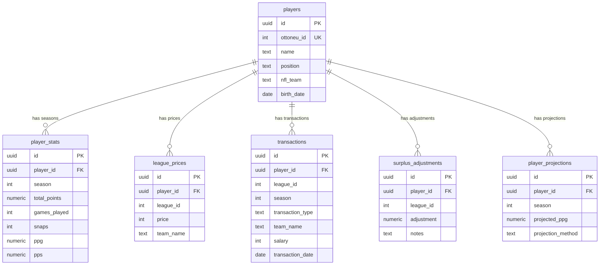
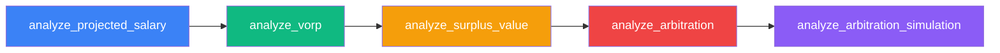
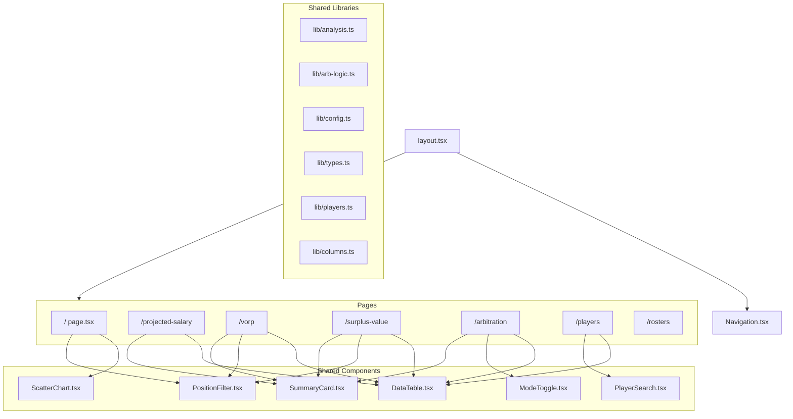

# Architecture

## System Overview

```mermaid
graph TD
    subgraph Data Collection
        E[enqueue.py] -->|insert jobs| SJ[scraper_jobs table]
        SJ -->|poll| W[worker.py]
        W -->|dispatch| T1[pull_nfl_stats]
        W -->|dispatch| T2[scrape_roster]
        W -->|dispatch| T3[scrape_player_card]
    end

    subgraph External Sources
        NFL[nfl_data_py API] --> T1
        OTT[Ottoneu Website] -->|Playwright| T2
        OTT -->|Playwright| T3
    end

    subgraph Supabase PostgreSQL
        T1 -->|upsert| PS[player_stats]
        T2 -->|upsert| P[players]
        T2 -->|upsert| LP[league_prices]
        T2 -->|upsert| PS
        T3 -->|upsert| TX[transactions]
    end

    subgraph Analysis Pipeline
        P & PS & LP & TX --> A1[analyze_projected_salary.py]
        A1 --> A2[analyze_vorp.py]
        A2 --> A3[analyze_surplus_value.py]
        A3 --> A4[analyze_arbitration.py]
        A4 --> A5[analyze_arbitration_simulation.py]
        A2 -->|calculate_vorp| A3
        A3 -->|calculate_surplus| A4
    end

    subgraph Next.js Frontend
        P & PS & LP & TX -->|@supabase/supabase-js| WEB[Next.js App Router]
        WEB --> PG1["/ — Player Efficiency"]
        WEB --> PG2["/projected-salary — Keep/Cut"]
        WEB --> PG3["/vorp — VORP Analysis"]
        WEB --> PG4["/surplus-value — Surplus Rankings"]
        WEB --> PG5["/arbitration — Arb Targets"]
        WEB --> PG6["/players — Player Cards"]
        WEB --> PG7["/rosters — Team Rosters"]
    end
```

## Database Entity Relationship



## Analysis Pipeline Dependency Order



Key dependencies:
- `analyze_vorp.py` exports `calculate_vorp()` used by surplus value
- `analyze_surplus_value.py` exports `calculate_surplus()` used by arbitration
- All scripts share config from `scripts/config.py` and helpers from `scripts/analysis_utils.py`

## Frontend Component Hierarchy



## Configuration Sync

Two config files must stay in sync:

| Python (`scripts/config.py`) | TypeScript (`web/lib/config.ts`) |
|------------------------------|----------------------------------|
| `LEAGUE_ID = 309` | `export const LEAGUE_ID = 309` |
| `SEASON = 2025` | `export const SEASON = 2025` |
| `MY_TEAM = "The Witchcraft"` | `export const MY_TEAM = "The Witchcraft"` |
| `NUM_TEAMS = 12` | `export const NUM_TEAMS = 12` |
| `CAP_PER_TEAM = 400` | `export const CAP_PER_TEAM = 400` |
| `REPLACEMENT_LEVEL = {...}` | `export const REPLACEMENT_LEVEL = {...}` |

When updating any constant, **update both files**.
