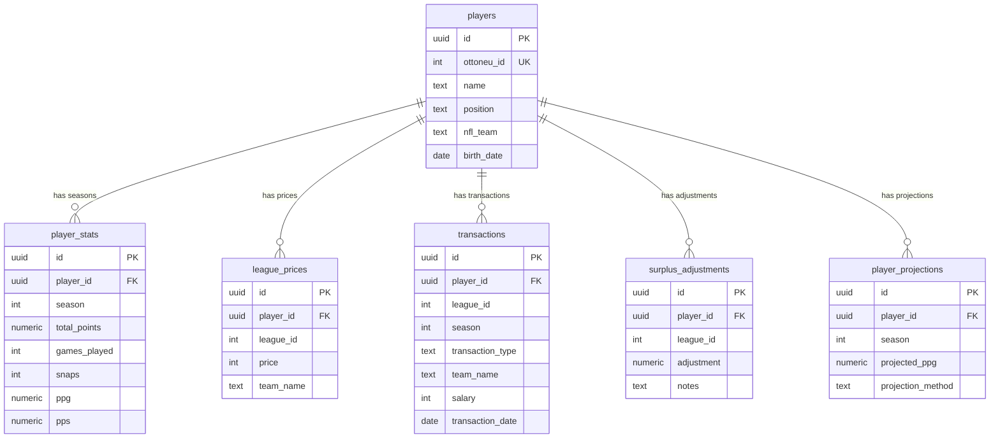

# Database

## Entity Relationship

## Schema Details

Six tables, all with UUID primary keys:

- **`players`** — Player metadata. Unique on `ottoneu_id`.
- **`player_stats`** — Season statistics. FK to `players`, unique on `(player_id, season)`.
- **`league_prices`** — Current salaries. FK to `players`, unique on `(player_id, league_id)`.
- **`transactions`** — Event log of all roster moves (adds, cuts, trades, auctions).
- **`surplus_adjustments`** — Manual value overrides per player per league.
- **`player_projections`** — Calculated projection outputs from Python backend.

See `schema.sql` for full DDL and `migrations/` for incremental changes.

## Environment Variables

**Root `.env`** (for Python scripts):
- `SUPABASE_URL` — Supabase project URL
- `SUPABASE_KEY` — Supabase anon/service key

**`web/.env.local`** (for Next.js):
- `NEXT_PUBLIC_SUPABASE_URL` — Supabase project URL
- `NEXT_PUBLIC_SUPABASE_ANON_KEY` — Supabase anon key
- `SUPABASE_SERVICE_ROLE_KEY` — Service role key (server-side only)

See `.env.example` and `web/.env.local.example` for templates.
